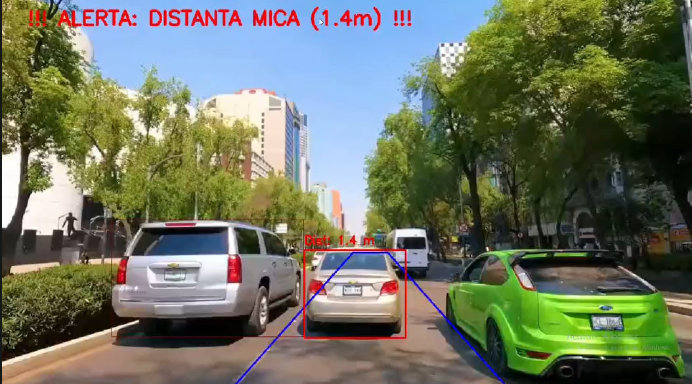

# ADAS: Distance Estimation & Forward Collision Warning

A Computer Vision-based Advanced Driver Assistance System (ADAS) that estimates the metric distance to the lead vehicle in real-time. This pipeline uses Deep Learning for object detection, geometric transformations for metric calculations, and mathematical filtering for data stabilization.

## 🌟 Key Features
* **Real-Time Object Detection:** Utilizes **YOLOv8** (nano) to identify vehicles (cars, buses, trucks) on the road.
* **Ego-Lane Isolation (ROI):** Implements a custom trapezoidal Region of Interest to ignore vehicles on adjacent lanes.
* **Bird's Eye View (BEV) Transformation:** Uses Homography (`cv2.getPerspectiveTransform`) to convert the camera perspective into a top-down view, allowing accurate pixel-to-meter conversion.
* **Kalman Filter Stabilization:** Eliminates detection noise and bounding box jitter, providing a smooth and continuous distance output.
* **Forward Collision Warning (FCW):** Triggers a visual alert when the distance drops below the critical safety threshold of 2 meters.

## 🛠️ Technical Pipeline
1. **Video Ingestion:** Frame-by-frame processing using OpenCV.
2. **Detection:** YOLOv8 bounding boxes filtered by classes.
3. **Geometry:** Mapping the bottom-center of the bounding box into the BEV space.
4. **Distance Calculation:** Converting Y-axis pixels in the BEV frame to real-world meters.
5. **Filtering:** Updating the Kalman Filter with the raw distance to get the smoothed distance.
6. **HMI (Human-Machine Interface):** Drawing dynamic bounding boxes (Green = Safe, Red = Warning) and distance text on the frame.

## 🚀 Installation & Usage

### Prerequisites
Ensure you have Python 3.8+ installed. It's recommended to run inside a virtual environment.

On Windows (PowerShell):

```powershell
(Set-ExecutionPolicy -Scope Process -ExecutionPolicy RemoteSigned)
& venv\Scripts\Activate.ps1
```

Install dependencies (from `requirements.txt`):

```bash
pip install -r requirements.txt
```

If you prefer a one-liner without `requirements.txt`:

```bash
pip install opencv-python numpy ultralytics
```

### Running the Project
1. (Optional) Clone the repository or prepare your project folder locally.

```bash
git init
# add remote later and push
```

2. Create a `data/` folder in the project root and put a test video named `video_test.mp4` (or update the path in `main.py`).

3. Ensure the YOLO model file `yolov8n.pt` is located in the project root (same folder as `main.py`) or update the path in the script.

4. Run the main script:

```bash
python main.py
```

Notes:
- The script will try `data/video_test.mp4` first; if missing it attempts camera index `0` as a fallback.
- Do NOT change the code for README-only updates — to change the FCW threshold, edit `WARNING_DISTANCE` in `main.py` (default currently set to `2.0` meters in the code).

## 📸 Demo


## 🔧 Tuning and Calibration
You can adjust the camera calibration parameters at the top of the script based on your specific dashcam angle and resolution:
* `BEV_LENGTH_METERS` - The real-world length represented by the BEV projection.
* `WARNING_DISTANCE` - Threshold for the FCW alert (currently set to 2.0m).
* `ORIZONT_Y`, `OFFSET_X` - Parameters to adjust the ego-lane trapezoid.

## 👨‍💻 Author
Developed as a Computer Science & ADAS engineering project.
